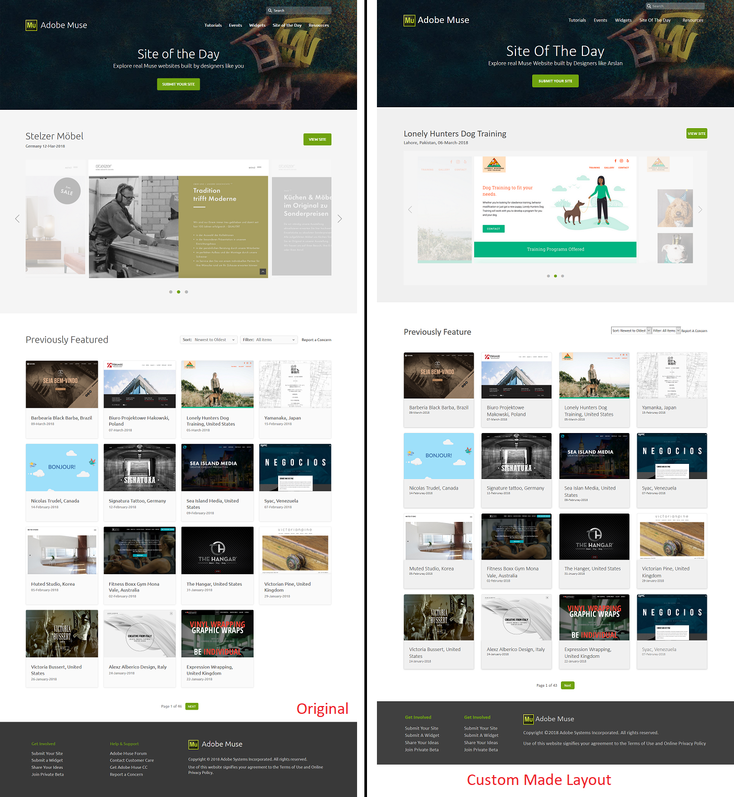

# Layout-Muse
A Simple and Delicate Single **_Static_** Page Layout made with Pure HTML5 CSS3 and JS.

This Layout is Not a clone but an approach to achieve [Adobe Muse - Site Of The Day](https://musewidgets.com/collections/site-of-the-day) layout.

It Is Responsive and Mobile Friendly Layout!

----------------------------------------------------------------
**TRY: Live Demo**: [Muse-Layout](https://arslanameer.github.io/Layout-Muse/)
----------------------------------------------------------------

----------------------------------------------------------------
**TRY: Live Demo**: [Muse-Layout](https://arslanameer.github.io/Layout-Muse/)

**Note**: Need Minor Improvements and Enhancements! (Updating Soon)

_(Arslan Ameer)_